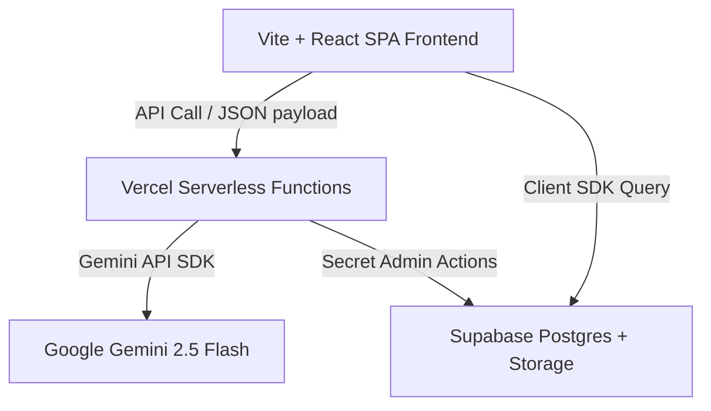

# JanSetu AI: A GenAI-Powered Civic Platform
### Product, Technical, and Execution Blueprint for 180-Minute Hackathon Build

This document outlines the end-to-end design, system architecture, database schema, API contracts, prompt engineering instructions, execution roadmap, and pitch strategy for **JanSetu AI** (The Citizen's Gateway)—a premium civic platform enabling digital inclusion, seamless grievance redressal, and simplified access to government benefits.

---

## 1. Product Requirements Document (PRD)

### 1.1 Product Vision
To empower every Indian citizen, regardless of digital literacy, language barriers, or socio-economic background, with a direct, transparent, and AI-enabled gateway to civic services, welfare benefits, and localized municipal resolution.

### 1.2 Target Audience
*   **Rural Citizens (e.g., Farmers, Daily Wage Earners):** High need for government welfare, low digital familiarity, primarily regional-language speakers.
*   **Urban Residents (e.g., Tenants, Shopkeepers, Commuters):** Need quick, frictionless ways to report public utility issues (potholes, water leaks, garbage pileups) and track local action.
*   **Marginalized/Elderly Citizens:** Need guidance on pension eligibility, documentation checklists, and administrative processes without middle-men.

### 1.3 User Personas

#### Persona A: Ramesh Kumar (Rural Farmer, 48)
*   **Background:** Lives in rural Uttar Pradesh. Operates a 1-acre farm. Speaks only Hindi.
*   **Tech Literacy:** Uses WhatsApp (voice notes) and YouTube. Struggles with formal website navigation and government portals.
*   **Goals:** Wants to check if he qualifies for the PM-KISAN subsidy and how to apply.

#### Persona B: Ananya Sen (Urban Resident, 28)
*   **Background:** Software QA engineer in Bengaluru. Active, tech-savvy.
*   **Tech Literacy:** High.
*   **Goals:** Report persistent garbage dumping on her street and track the municipal corporation’s progress without visiting the office.

### 1.4 Problem Statement
The Indian digital public infrastructure has digitized hundreds of public services and welfare schemes. However, citizen access remains severely bottlenecked by:
1.  **Complexity:** Government websites are text-heavy, full of legal jargon, and highly bureaucratic.
2.  **Language Barriers:** Most portals default to English or formal Hindi, alienating dialect speakers.
3.  **Friction in Reporting:** Filing municipal complaints requires navigating outdated web portals, finding the correct department, and drafting formal letters.
4.  **Information Asymmetry:** Citizens do not know what schemes they are eligible for, leading to high dependence on brokers.

### 1.5 Value Proposition
*   **Zero-Jargon Conversational AI:** Simplifies complex rules into bite-sized conversational responses in the user's native language.
*   **Contextual Scheme Discovery:** Suggests personalized government benefits based on self-reported demographic profiling.
*   **Multimodal Issue Intake:** Auto-generates formal civic reports and pinpoints departments from a simple photo upload.
*   **End-to-End Transparency:** Transparent status dashboard showing the live lifecycle of a filed complaint.

### 1.6 Core Features (MVP)
1.  **Multilingual Conversational Companion (Voice-to-Text Ready):** High-speed chat interface capable of switching between English, Hindi, Tamil, and Bengali.
2.  **Multimodal Civic Issue Reporter:** File complaints via drag-and-drop images. AI auto-extracts issue category, urgency level, and drafts the municipal complaint letter.
3.  **Welfare Scheme Matcher:** Guided input wizard mapping profiles to eligibility rules of major schemes.
4.  **Live Grievance Tracker:** Status pipeline (Submitted -> Under Review -> Action Initiated -> Resolved) backed by real-time database updates.

### 1.7 Nice-to-Have Features (Post-MVP)
*   WhatsApp chatbot mirroring the web interface.
*   Automatic email forwarding to the municipal officer in charge.
*   Community support module allowing local neighbors to upvote or add notes to an active ticket.

### 1.8 User Stories
*   *As Ramesh,* I want to ask in Hindi about pension eligibility so that I can understand the age and land requirements immediately.
*   *As Ananya,* I want to upload a photo of a broken street light, have the AI draft the official complaint, and see the ticket move through stages.
*   *As a local municipal officer,* I want complaints to arrive pre-classified with priority tags and geolocation so that I can assign them immediately.

### 1.9 Success Metrics
*   **Demo-Speed Index:** Time to file a complete complaint (from photo to submission) under 30 seconds.
*   **Zero-Friction Friction Rate:** Under 5% fallback/error rate in the LLM-driven schema mapping.
*   **First-Contact Resolution:** Percentage of user queries answered directly by the AI chatbot without requiring external links.

### 1.10 Future Scope
*   Direct integration with DigiLocker for automated document fetching and validation.
*   Offline capability using local on-device SLMs (Small Language Models) for areas with poor connectivity.

---

## 2. Technical Requirements Document (TRD)

We recommend a completely free, highly performant stack optimizing for rapid development, rich visuals, and zero infrastructure setup.



### 2.1 Technology Selection & Rationale

| Layer | Technology | Cost / Tier | Why Chosen |
| :--- | :--- | :--- | :--- |
| **Frontend** | React (Vite) + Vanilla CSS | Free | Vite boots instantly and builds in seconds. Vanilla CSS using global custom variables provides pixel-perfect styling, high responsiveness, and zero build compilation issues. |
| **Database & Auth** | Supabase (PostgreSQL) | Free tier (500MB DB) | Built-in authentication, instant REST API, and native Postgres real-time updates via WebSockets for dynamic complaint status changes. |
| **Hosting** | Vercel | Free Hobby Tier | 1-click CI/CD integration from Git, built-in Serverless Functions with auto-configured CORS, fast global CDN edge. |
| **AI Model** | Google Gemini 2.5 Flash | Free (via Google AI Studio) | High free token allowance, rapid completion response times, natively multimodal (crucial for pothole/garbage photo analysis), and excellent benchmark scores in Indian languages. |

### 2.2 Project Folder Structure
A highly modular, flat structure optimizing for easy visual verification and file separation:

```
jansetu-ai/
├── api/                     # Serverless endpoints (Vercel Functions)
│   ├── chat.js              # Handles chat sessions
│   ├── analyze-issue.js     # Multimodal analysis of images
│   └── match-schemes.js     # Semantic scoring for schemes
├── src/
│   ├── assets/              # Logos, default fallback images
│   ├── components/
│   │   ├── ChatBot.jsx      # Chat interface & floating bubble
│   │   ├── FileIssue.jsx    # Drag-and-drop reporter with canvas mapping
│   │   ├── SchemeFinder.jsx # User profile eligibility card list
│   │   ├── Tracker.jsx      # Visual timeline tracker for complaints
│   │   └── Layout.jsx       # Header, Sidebar, and Language Context
│   ├── services/
│   │   ├── supabase.js      # DB client connection
│   │   └── gemini.js        # Helper to invoke serverless AI endpoints
│   ├── styles/
│   │   ├── variables.css    # Colors, fonts, spacing configurations
│   │   └── main.css         # Component specific CSS overrides
│   ├── App.jsx              # Routing & application entry
│   └── main.jsx             # React DOM root setup
├── .env.example
├── package.json
└── vite.config.js
```

### 2.3 API Interface Contracts
*   `POST /api/chat`: Runs conversation context against historical session records.
*   `POST /api/analyze-issue`: Decodes base64-encoded image payloads. Returns categorized JSON mapping.
*   `POST /api/match-schemes`: Compares profile traits (age, income, state) against schema records to rank relevant benefits.

### 2.4 Environment Variables Setup
Create `.env` at the root:
```env
# Client-side configuration
VITE_SUPABASE_URL=https://your-project-id.supabase.co
VITE_SUPABASE_ANON_KEY=eyJhbGciOiJIUzI1NiIsInR5cCI6IkpXVCJ9...

# Server-side (Vercel Dashboard / local runtime environment)
GEMINI_API_KEY=AIzaSy...
SUPABASE_SERVICE_ROLE_KEY=eyJhbGciOiJIUzI1NiIsInR5...
```

---

## 3. Feature Prioritization (MoSCoW Matrix)

To deliver a polished MVP within a strict 3-hour constraint, features are categorized as follows:

```
┌──────────────────────────────────────┐  ┌──────────────────────────────────────┐
│             MUST HAVE                │  │            SHOULD HAVE               │
│ • Floating Multilingual Chatbot      │  │ • Interactive Geotagging Canvas      │
│ • Multimodal Image Issue Analyzer    │  │ • Dynamic PDF Complaint Letter Draft │
│ • Profile-Based Scheme Recommender   │  │ • Scheme Search Filter Bar           │
│ • Real-time Status Tracker Timeline  │  │                                      │
└──────────────────────────────────────┘  └──────────────────────────────────────┘
┌──────────────────────────────────────┐  ┌──────────────────────────────────────┐
│             COULD HAVE               │  │            WON'T BUILD               │
│ • Speech-to-Text voice inputs        │  │ • Real government API submission     │
│ • SMS notification via Twilio        │  │ • Multi-factor Aadhaar auth          │
│ • Municipal officer control panel    │  │ • Real payment gateway integration   │
└──────────────────────────────────────┘  └──────────────────────────────────────┘
```

*   **Reasoning for "Won't Build":** Integrating with actual government municipal portals or verification APIs (like Aadhaar card APIs) requires official sandbox access, legal clearances, and long verification times, which are impossible during a 3-hour hackathon. The MVP will mock the *receipt* of the ticket by the government system.

---

## 4. Application Flow

```
[Visitor] ──> [Landing Page] ──> [Language Selection]
                    │
      ┌─────────────┼─────────────┐
      ▼             ▼             ▼
[AI Companion] [Scheme Matcher] [Issue Reporter]
      │             │             │
      │             ▼             ▼
      │        [Checklist]   [Live Timeline Tracker]
      ▼             │             │
[Feedback/Exit] ◄───┴─────────────┘
```

### 4.1 Step-by-Step User Journey
1.  **Landing Page & Onboarding:**
    *   Citizen lands on a dashboard featuring visual counters of resolved complaints and a prominent language selector overlay (Defaults to Hindi / English / Tamil / Bengali).
    *   User opts for quick login via a 1-click **"Guest Sandbox Login"** to skip password forms for demo purposes.
2.  **Welfare Scheme Matcher:**
    *   The citizen enters profile parameters (Age: 32, Income: ₹95,000/yr, Occupation: Farmer, State: Uttar Pradesh).
    *   JanSetu returns a list of tailored matching schemes.
    *   Clicking a scheme opens the **AI Document Assistant**, illustrating step-by-step documentation guides.
3.  **Issue Reporting (Multimodal Intake):**
    *   Citizen uploads a photo of a large pothole.
    *   JanSetu uses Gemini to instantly classify it under "Roads & Maintenance", assign "High" priority, extract structural damage details, and write a formal complaint letter.
    *   The user clicks "Submit Issue".
4.  **Live Status Tracking:**
    *   The screen transitions immediately to a timeline dashboard.
    *   The status transitions dynamically to simulate real administrative actions, verifying state management and live database hooks.

---

## 5. UI/UX Design Brief

The platform utilizes a state-of-the-art **"Civic Glassmorphism"** theme—merging administrative gravitas with modern web elegance.

### 5.1 Design Tokens

*   **Color Palette:**
    *   `bg-gradient-dark`: Deep Slate Space (`#080A10` to `#101424`)
    *   `card-bg`: Frosted dark glass (`rgba(20, 24, 45, 0.6)` with backdrop filter blur of `12px`)
    *   `primary-orange`: Modern Vibrant Saffron (`#FF7A30`)
    *   `primary-blue`: Ashoka Navy Blue (`#3B82F6` / `#1E40AF`)
    *   `success-green`: Emerald Mint (`#10B981`)
    *   `border-color`: Translucent silver (`rgba(255, 255, 255, 0.08)`)

*   **Typography:**
    *   **Headers:** `Outfit`, sans-serif (clean letter-spacing, tracking-tight).
    *   **Body:** `Inter`, sans-serif (excellent legibility at small sizes).

*   **Spacing:**
    *   Consistent 8px grid alignment. Card padding set to a comfortable `24px` (`1.5rem`) with clear separation of actions.

*   **Interface Elements:**
    *   **Cards:** Translucent border overlay (`1px solid rgba(255, 255, 255, 0.08)`), rounded borders (`16px`), drop shadow (`0 20px 25px -5px rgba(0,0,0,0.3)`).
    *   **Interactive Glowing Glow:** The main AI Companion button features a radial backdrop pulse (`filter: drop-shadow(0 0 12px var(--primary-orange))`).

### 5.2 Accessibility (A11y)
*   Contrast ratio exceeding `4.5:1` for body text against dark backgrounds.
*   Clear visual focus rings around inputs and clickable elements for keyboard navigation.
*   Text sizes using `rem` units for smooth browser scaling compatibility.

---

## 6. Database Schema (Supabase PostgreSQL DDL)

We use a clean relational structure designed to handle chat history, scheme details, issues, and metadata.

```sql
-- 1. Languages Table
CREATE TABLE public.languages (
    code VARCHAR(5) PRIMARY KEY, -- e.g., 'en', 'hi', 'ta', 'bn'
    name VARCHAR(50) NOT NULL,
    native_name VARCHAR(50) NOT NULL
);

INSERT INTO public.languages (code, name, native_name) VALUES
('en', 'English', 'English'),
('hi', 'Hindi', 'हिन्दी'),
('ta', 'Tamil', 'தமிழ்'),
('bn', 'Bengali', 'বাংলা');

-- 2. Users Table
CREATE TABLE public.users (
    id UUID REFERENCES auth.users ON DELETE CASCADE PRIMARY KEY,
    full_name VARCHAR(255),
    language_preference VARCHAR(5) DEFAULT 'en' REFERENCES public.languages(code),
    state VARCHAR(100),
    occupation VARCHAR(100),
    annual_income NUMERIC,
    created_at TIMESTAMP WITH TIME ZONE DEFAULT TIMEZONE('utc'::text, NOW()) NOT NULL
);

-- 3. Welfare Schemes Table
CREATE TABLE public.schemes (
    id UUID DEFAULT gen_random_uuid() PRIMARY KEY,
    title JSONB NOT NULL, -- Multilingual titles: {"en": "...", "hi": "..."}
    description JSONB NOT NULL,
    category VARCHAR(100) NOT NULL,
    state_eligibility VARCHAR(100) DEFAULT 'All',
    eligibility_rules JSONB NOT NULL, -- Min/Max age, Income constraints
    required_documents JSONB NOT NULL, -- List of docs
    created_at TIMESTAMP WITH TIME ZONE DEFAULT TIMEZONE('utc'::text, NOW()) NOT NULL
);

-- 4. Complaints Table
CREATE TABLE public.complaints (
    id UUID DEFAULT gen_random_uuid() PRIMARY KEY,
    user_id UUID REFERENCES public.users(id) ON DELETE SET NULL,
    title VARCHAR(255) NOT NULL,
    category VARCHAR(100) NOT NULL,
    description TEXT NOT NULL,
    image_url TEXT,
    priority VARCHAR(10) CHECK (priority IN ('Low', 'Medium', 'High', 'Critical')),
    status VARCHAR(20) DEFAULT 'Submitted' CHECK (status IN ('Submitted', 'Under Review', 'Action Initiated', 'Resolved')),
    official_draft TEXT, -- Pre-filled AI drafted letter
    latitude NUMERIC,
    longitude NUMERIC,
    created_at TIMESTAMP WITH TIME ZONE DEFAULT TIMEZONE('utc'::text, NOW()) NOT NULL
);

-- 5. Chat History Table (JSONB array for speed & scale)
CREATE TABLE public.chat_history (
    id UUID DEFAULT gen_random_uuid() PRIMARY KEY,
    user_id UUID REFERENCES public.users(id) ON DELETE CASCADE,
    messages JSONB DEFAULT '[]'::jsonb NOT NULL,
    updated_at TIMESTAMP WITH TIME ZONE DEFAULT TIMEZONE('utc'::text, NOW()) NOT NULL
);
```

---

## 7. REST API Design

To simplify integrations, all APIs accept and return strict JSON payloads.

### 7.1 Chat Message Handler
*   **Method:** `POST`
*   **Endpoint:** `/api/chat`
*   **Request Headers:** `Content-Type: application/json`
*   **Request Payload:**
```json
{
  "userId": "c7a942fb-bc5e-44ef-ad75-b3a63ad1b559",
  "languageCode": "hi",
  "message": "मुझे वृद्धावस्था पेंशन योजना के बारे में बताएं।"
}
```
*   **Response Payload:**
```json
{
  "reply": "उत्तर प्रदेश वृद्धावस्था पेंशन योजना के तहत, 60 वर्ष या उससे अधिक आयु के नागरिक आवेदन कर सकते हैं...",
  "suggestedActions": [
    "पात्रता की जांच करें",
    "आवश्यक दस्तावेज देखें"
  ]
}
```
*   **Status Codes:** `200 OK`, `400 Bad Request`, `500 Server Error`

### 7.2 Multimodal Issue Analyzer
*   **Method:** `POST`
*   **Endpoint:** `/api/analyze-issue`
*   **Request Payload:**
```json
{
  "imageBase64": "data:image/jpeg;base64,/9j/4AAQSkZJRgABAQE...",
  "userDescription": "Garbage dump near public school, causing blockages and smell."
}
```
*   **Response Payload:**
```json
{
  "title": "Unregulated Waste Dumping Near Public School",
  "category": "Sanitation & Waste Management",
  "urgency": "High",
  "summary": "Accumulated solid waste blockading the drainage pathway directly outside the primary school perimeter.",
  "officialDraft": "To,\nThe Ward Commissioner,\nBengaluru Municipal Corporation...\nSubject: Urgent Redressal Required for Sanitation Hazards..."
}
```
*   **Status Codes:** `200 OK`, `422 Unprocessable Entity (Bad Image File)`

### 7.3 Welfare Scheme Matcher
*   **Method:** `POST`
*   **Endpoint:** `/api/match-schemes`
*   **Request Payload:**
```json
{
  "state": "Uttar Pradesh",
  "occupation": "Farmer",
  "age": 45,
  "annualIncome": 75000
}
```
*   **Response Payload:**
```json
{
  "matches": [
    {
      "schemeId": "e8574109-1a52-4467",
      "title": "PM Kisan Samman Nidhi",
      "matchScore": 0.98,
      "eligibilityReason": "Matches landholding occupation profile and income parameters.",
      "requiredDocuments": ["Aadhaar Card", "Land Ownership Proof", "Bank Account Details"]
    }
  ]
}
```

---

## 8. AI Prompt Engineering

The system uses highly constrained system instructions to eliminate hallucinations and output parsed JSON arrays.

### 8.1 Prompt 1: Government Assistant (Multi-turn Support)
```
You are JanSetu AI, an expert, empathetic, and objective government concierge helper.
Your primary role is to answer citizen queries regarding public services, civic duties, and documentation.

Strict Rules:
1. Speak in a helpful, simplified tone. Avoid bureaucratic legalese.
2. Structure your response using markdown sections:
   ### Summary
   ### Eligibility Details
   ### Next Steps
3. If you do not know the answer based on official Indian governance databases, respond: "मुझे इस समय इस योजना की सटीक जानकारी नहीं है। कृपया नजदीकी जन सेवा केंद्र (CSC) से संपर्क करें।" Do not invent schemes.
4. Output response in the language specified in context. Current language code: {{languageCode}}
```

### 8.2 Prompt 2: Multimodal Complaint Builder
```
You are a public safety and municipal administration auditor.
Analyze the provided image and user description of the public issue.
Generate a structured JSON output matching this schema:

{
  "title": "Short descriptive title of the issue",
  "category": "One of [Roads, Sanitation, Water Supply, Electricity, Public Safety, Others]",
  "urgency": "One of [Low, Medium, High, Critical]",
  "summary": "2-sentence objective summary of the visual evidence",
  "officialLetter": "A formal, polite complaint letter template addressed to the local Municipal Commissioner. Do not use placeholding strings like '[Your Name]', auto-fill using the context 'Citizen Citizen' and placeholder dates."
}

Ensure the output is valid JSON and containing ONLY the JSON block. Do not wrap in ```json ``` blocks.
```

### 8.3 Prompt 3: Scheme Match Checker
```
You are a database classification filter.
Compare the citizen's profile inputs against the provided active schemes rules.

User Profile:
- State: {{state}}
- Occupation: {{occupation}}
- Age: {{age}}
- Income: {{annualIncome}}

Verify logic matches:
1. If income is higher than the scheme limit, reject immediately.
2. If state is not "All" and does not match the user's state, reject immediately.

Return a sorted JSON array containing the match metrics. Format:
[
  {
    "schemeName": "Scheme Name",
    "matchScore": 0.0 to 1.0,
    "reason": "Clear explanation of eligibility criteria matched."
  }
]
```

---

## 9. Development Roadmap (180 Minutes)

This minute-by-minute execution plan maps how a solo developer can build and deploy the functional JanSetu MVP.

```
00h ───────────────── 01h ───────────────── 02h ───────────────── 03h
[Init Repo & DB]   [UI & Layout]      [AI Integrations]   [Verify & Deploy]
    15 mins            45 mins            60 mins             60 mins
```

### 9.1 Phase-by-Phase Roadmap

#### **0–15 Minutes: Environment, Repo & Database Setup**
*   Create new repository: `npx -y create-vite-app@latest ./` (React + vanilla JS).
*   Initialize Supabase database project; execute the DDL queries in the Supabase SQL editor to create the `users`, `complaints`, and `schemes` tables.
*   Populate 3 default welfare schemes (e.g., PM-KISAN, PM Awas Yojana, Senior Citizen Pension) using mock SQL statements.

#### **15–30 Minutes: Core API Wrappers & SDKs**
*   Install client dependencies: `npm install @supabase/supabase-js lucide-react`.
*   Create `src/services/supabase.js` and initialize the client configuration.
*   Write basic mock functions in `/api/` folders on the local dev server matching the REST endpoints.

#### **30–60 Minutes: Responsive CSS Layout & Custom Glass Theme**
*   Set up CSS variables for Saffron, Blue, Slate backgrounds, and text states inside `src/styles/variables.css`.
*   Build `Layout.jsx` with a navigation header, real-time activity status bar, and active language dropdown indicator.
*   Ensure full responsive grids matching mobile screen viewports.

#### **60–90 Minutes: Core Feature A - The AI Chat Panel**
*   Develop `ChatBot.jsx` matching the mock visual layout (glowing bubble, overlay window, scrollable content).
*   Connect the chat container state to call the `/api/chat` function.
*   Implement language toggle states that change mock prompts dynamically based on selection.

#### **90–120 Minutes: Core Feature B - Grievance Image Upload & Canvas**
*   Develop `FileIssue.jsx` displaying a drag-and-drop file target.
*   Use standard `<input type="file">` converting photos to Base64.
*   Wire the button call to `/api/analyze-issue` and map the return values to fill editable text-areas showing the AI-generated official letter draft.

#### **120–150 Minutes: Core Feature C - Scheme Engine & Live Status Tracker**
*   Create `SchemeFinder.jsx` displaying small profile sliders (Age, Income). On slide change, send filter queries to Supabase.
*   Create `Tracker.jsx` subscribing to Supabase real-time events. Changing a database row status column triggers immediate visual animations on the timeline.

#### **150–180 Minutes: Deployment, Quality Polish & Pitch Prep**
*   Publish repo to GitHub; connect Git repository to Vercel dashboard.
*   Input the system API keys into the Vercel dashboard variables page.
*   Verify production build compiles cleanly without errors.
*   Create demo user instances, draft sample reports, and run through the 2-minute demo sequence twice to ensure timing.

---

## 10. Demo Strategy & Pitch Playbook

### 10.1 2-Minute Demo Script (The "Walkthrough")
*   **0:00 - 0:20 (The Hook):**
    > "Half of India's population struggles to access government services due to two hurdles: complex administrative language and regional language barriers. Today, we introduce **JanSetu AI**—the intelligent bridge connecting citizens and local governance."
*   **0:20 - 0:50 (Live AI Chat Demo):**
    > "Let’s look at Ramesh. He only speaks Hindi and wants to know about pension options. I’ll toggle the site language to Hindi and type: *'मुझे पेंशन के बारे में बताओ'*. Within 1 second, JanSetu returns a simplified overview of age and income rules without confusing terminology."
*   **0:50 - 1:20 (Multimodal Grievance Reporting):**
    > "What about urban problems? If a citizen notices an illegal dump, they can open our reporter, drag in a picture, and click analyze. Gemini analyzes the visual proof, auto-categorizes it, tags it as high priority, and drafts an official letter ready for submission. 1 click, and it is on the municipal dashboard."
*   **1:20 - 1:40 (Real-Time Tracker):**
    > "Once submitted, the user sees this live status timeline. Watch as the municipal officer changes the status on their end—the dashboard updates instantly in real time via WebSockets, eliminating the black hole of civic reporting."
*   **1:40 - 2:00 (The Wrap-Up):**
    > "JanSetu AI is lightweight, runs on free-tier infrastructure, works in local languages, and transforms citizen participation. Thank you."

### 10.2 Judge Talking Points & Differentiators
1.  **Multimodal Civic Processing:** Combining vision LLMs to parse image evidence with structured data generation.
2.  **No-Code Demographics:** Dynamic local matching database filters that prevent queries that do not match target demographics.
3.  **Real-Time Architecture:** Real-time updates build citizen trust.

### 10.3 Expected Judge Q&A and Answers

*   **Q1: How do you handle language translation inaccuracies in critical legal documents?**
    *   *Answer:* The AI never directly submits files. It generates a clear letter template for the user to review, edit, and confirm. This keeps the human in the loop while handling the heavy lifting of drafting.
*   **Q2: Will this system crash if 100,000 citizens upload high-res images at the same time?**
    *   *Answer:* The architecture uses client-side compression before sending images to the API. In production, image uploads are sent directly to secure Supabase Storage buckets using pre-signed URLs, keeping serverless functions fast and lightweight.
*   **Q3: How do you prevent users from uploading fake or AI-generated garbage/pothole photos to spam the system?**
    *   *Answer:* Gemini analyzes metadata alongside the image context. It verifies if the image contents match a real street view before accepting the report, filtering out unrelated uploads or spam.
